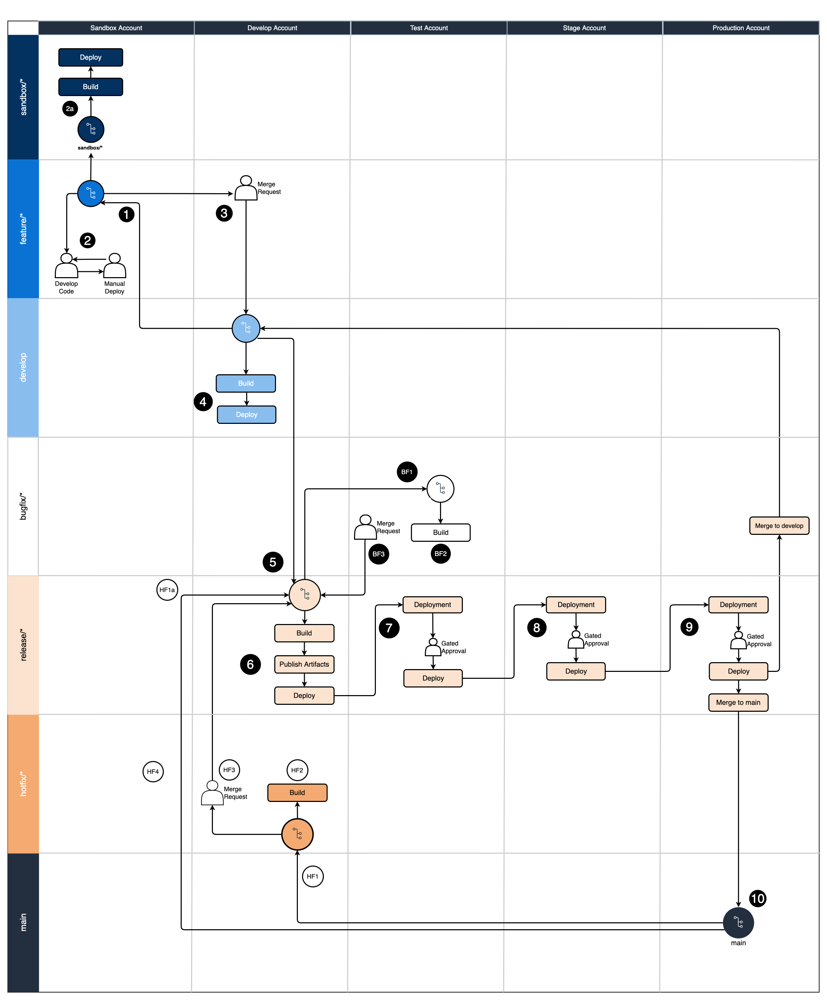

# Git Branching Strategy for GitFlow

## Summary
Clients that are implementing DevOps processes would benefit from a visual guide to assist them in understanding how a Git branching strategy can inform deployments to different environments with their DevOps processes. Using a standard workflow for managing the source code repository like GitFlow will assist development teams in aligning their work as a team.

This guide provides a visual diagram to illustrate how a DevOps process following GitFlow could be implemented by an organization. This guide also includes recommended tasks to perform at each step in the DevOps process.

The linked Git repository contains a diagram outlining the recommendations and can be used like a [punnett square](https://en.wikipedia.org/wiki/Punnett_square) to line up the branches on the horizontal axis with the AWS environments on the vertical axis to determine what actions to perform in each scenario.

The numbers in circles are to be used as a guide to help understand the order in which to follow the diagram with an example feature all the way to production deployment. 

## Prerequisites
- Install [Git](https://git-scm.com/downloads) for source code repository tool
- Install [Draw.io](https://github.com/jgraph/drawio-desktop/releases) Desktop to view/edit the diagram 
- Optionally install [GitFlow plugin](https://github.com/nvie/gitflow)

---------------

## Architecture
### Target technology stack
This pattern can be applied to any technology stack but targets using the “GitFlow” branching strategy popularized for the Git distributed version control system.

### Automation and scale
This is a visual guide to implement automation of the DevOps processes for each step in the GitFlow workflow.

## Tools
- [Draw.io Desktop](https://github.com/jgraph/drawio-desktop/releases)
- [GitFlow plugin](https://github.com/nvie/gitflow), optional

## Code
- Draw.io diagram to review [here](https://gitlab.aws.dev/proserve-tdx/incubator/git-branching-strategy-for-gitflow/-/blob/main/GitFlowBranchingWithDevopsOverview.drawio)
- Diagram can be used to modify for your organizations preferences

## APG
Please reference the internal [APG artifact](https://apg-library.amazonaws.com/content/1dee2a06-cc54-4797-b9a9-78b6685edd33) for further information.

## Diagram

------------------

## Best Practices
DevOps practices vary across organizations and this guide is intended to be used as a quick start and discussion starter for the organization or development teams within it.

This artifact isn’t intended to weigh the pros or cons of one workflow versus another but rather document how the GitFlow approach can work with an organization's DevOps processes.

To successfully adopt GitFlow-based development, it's important to follow a set of best practices that promote collaboration, maintain code quality, and support continuous integration and delivery. Here are some key best practices for GitFlow-based development:

1. Keep changes small and frequent: Encourage developers to commit small, incremental changes/features. This reduces the risk of merge conflicts and makes it easier to identify and fix issues quickly.

2. Use feature toggles: To manage the release of incomplete or experimental features, use feature toggles or feature flags. This allows you to hide, enable, or disable specific features in production without affecting the main branch's stability.

3. Maintain a robust test suite: A comprehensive, well-maintained test suite is crucial for detecting issues early and ensuring the codebase remains stable. Make sure to invest in test automation and prioritize fixing any failing tests.

4. Embrace continuous integration: Use continuous integration tools and practices to automatically build, test, and integrate code changes into the develop branch. This helps catch issues early and streamlines the development process.

5. Perform code reviews: Encourage peer code reviews to maintain code quality, share knowledge, and catch potential issues before they're integrated into the main branch. Use pull requests or other code review tools to facilitate this process.

6. Monitor and fix broken builds: When a build breaks or tests fail, prioritize fixing the issue as soon as possible. This ensures the develop branch remains in a releasable state and minimizes the impact on other developers.

7. Communicate and collaborate: Promote open communication and collaboration among team members. Ensure developers are aware of ongoing work and changes being made to the codebase.

8. Refactor continuously: Regularly refactor the codebase to improve its maintainability and reduce technical debt. Encourage developers to leave the code in a better state than they found it.

9. Use short-lived branches for complex tasks: For larger or more complex tasks, you can still use short-lived branches (also known as "task branches") to work on the changes. However, make sure to keep the branch lifespan short (typically less than a day) and merge the changes back into the develop branch as soon as possible. Smaller more frequent merges and reviews are easier for a team to consume and process than one large merge request. Your colleagues will thank you.

10. Train and support the team: Provide training and support to developers who are new to GitFlow-based development or may require guidance in adopting its best practices.

By following these best practices, you can effectively implement GitFlow-based development, fostering collaboration, improving code quality, and streamlining the development process.

## What is GitFlow?
GitFlow is a branching model that involves the use of feature branches and multiple other named primary branches to move code between development and production. GitFlow works well for teams that have scheduled release cycles and a need to define a collection of features as a release.  Development is completed in individual feature branches that are merged with approval into an integration branch where they should be considered ready for production.  Once enough features have accumulated in the integration branch, a release is created for deployments to upper level environments. This separation allows for better control over what changes are moving to which named environment on a schedule. This process can be accelerated into a faster deployment model if necessary.

- [The original GitFlow blog](https://nvie.com/posts/a-successful-git-branching-model/)
- [Atlassian GitFlow Workshop](https://www.atlassian.com/git/tutorials/comparing-workflows/gitflow-workflow)

# Advantages
GitFlow-based development offers several advantages that can improve the development process, streamline collaboration, and enhance the overall quality of the software. Here are some of the key benefits:

1. Predictable Release Process: GitFlow follows a regular and predictable release process and is well suited to teams with regular development and release cadences.
1. Easier Collaboration: GitFlow encourages use of feature and release branches. These two branches allow for teams to work in parallel with minimal dependencies on each other. 
1. Well Suited for Multi-Environments: GitFlow utilizes release branches which can be longer lived branches and target individual releases over a longer period of time. 
1. Multiple Versions in Production: If your team supports multiple versions of the software in production the release branches that GitFlow offers provides an easy mechanism to support this requirement.
1. Built-in Code Quality Reviews: GitFlow requires / encourages the use of code reviews and approvals before code is promoted to another branch. This process removes any friction between developers by requiring this step for all promotions of code.
1. Organization: GitFlow has adavantages at an organization level as well. The organization can now understand what the expected release cycle is because GitFlow encourages the use of a standard release cycle. Because the business now understands when new features can be delivered there is reduced friction for the timelines because there are set delivery dates built into this pattern.

While GitFlow-based development has its advantages, it's important to remember that it may not be suitable for all teams or projects. The choice between GitFlow-based strategy and other strategies depends on various factors, such as team size, project requirements, and the desired balance between collaboration, integration frequency, and release management.

## Disadvantages
GitFlow-based development does have some disadvantages, which can impact the development process and the team dynamics. Here are a few notable drawbacks:

1. Complexity: GitFlow is a complex pattern for new teams to learn and you must adhere to the rules of GitFlow to use this successfully. 
1. Continuous Deployment: GitFlow doesn't fit a model where many deployments are released to production in a rapid fashion since GitFlow requires the use of multiple branches and release management flow.
1. Branch Management: GitFlow utilizes many branches, which can become burdonsome to maintain and merge released code into to keep the branches properly aligned with each other.
1. Technical Debt: Because releases take more time than with other models, more features can accumulate for release which can cause technical debt to accumulate. 

Teams should carefully consider these drawbacks when deciding whether GitFlow-based development is the right approach for their project.

---------------

##DevOps Overview

## Accounts / Environments
Most organizations have several environments or accounts outlined for use: 

### Sandbox 
Environment where developers write code, make mistakes, perform proof of concept work.
### Development
Environment where developers integrate their code together to ensure it all works as one cohesive application.
### Test
Environment where QA teams or acceptance testing takes place. Often teams will do performance or integration testing in this environment.
### Stage
Pre-production environment. This environment is configured the same as the Production environment to ensure that code and infrastruction will operate normally in Production. 
### Production
This is the environment that is running in production and handling real client traffic.

-------------

## GitFlow Branches
### main
The main branch always represents the code that is running in production.

Code is merged into the main branch automatically from a release branch after a successful deployment from the release pipeline.

Main branch should have branch protection enabled to prevent deletion.

##### Naming Convention
`main`

-------
### develop
The develop branch is where features are integrated, built, validated, and deployed to the develop environment.
All feature branches are Merge Requested into the develop branch and require a successful build and two developer approvals.

Develop branch should have branch protection to prevent deletion.

##### Naming Convention
`develop`

-------

### feature
Feature branches are where the development of features is completed. 
The feature branch is created by branching off of the develop branch using the name pattern of `feature/<story number>_<Developer initials>_<Descriptor>`
Developers will iterate on the code and commit and test code in the feature branch. 
Once the feature is complete the developer will promote the feature forward.
There are only two paths forward from a feature branch.
- Merge into the sandbox branch
- Create a merge request into the develop branch.

##### Naming Convention
`feature/<ticket>_<Developer initials>_<Descriptor>`
##### Example
`feature/123456_MS_Implement_Feature_A`

-------

### release
Release branches in GitFlow are special and can be deployed to multiple environments embracing the build once deploy many methodology. 
Once a development team has decided to promote features into higher environments they should create a new release branch with version number from the develop branch. 

Release branches can target the Test, Staging, or Production environments.
Deployments should require manual approval gates before allowing deployment to proceed.

Release branches should require a merge request to be changed.

##### Naming Convention
`release/v{major}.{minor}`
##### Example
`release/v1.0`

-------

### hotfix
The hotfix branch is used to fix issues in production and should only be used to promote fixes required to be expedited to the production environment. 

hotfix branches are always branched off of main

After the hotfix is tested it can be promoted to production through a merge request a release branch that was created from main to push forward to include the normal release process to other environments for testing.

##### Naming Convention
`hotfix/<ticket>_<Developer initials>_<Descriptor>`
##### Example
`hotfix/123456_MS_Fix_Problem_A`

-------

### bugfix
The bugfix branch is used to fix issues in release branches that are pending release to production and should only be used to promote fixes in release branches to the Test, Staging, or Production environments. 

bugfix branches are always branched off of a release branch.

After the bugfix is tested it can be promoted to the release branch through a merge request to push forward to include the normal release process.

Once the release branch has deployed to main, it should be merged back into develop and main to ensure any bugfixes or hotfixes are merged back into future development efforts.

##### Naming Convention
`bugfix/<ticket>_<Developer initials>_<Descriptor>`
##### Example
`bugfix/123456_MS_Fix_Problem_A`

-------

### sandbox
This branch is a non-standard GitFlow branch but it useful for pipeline development.
The sandbox branch is primarily used for two purposes outlined below.
- Perform a full deployment to the Sandbox environment using the build & deployment pipelines. 
- Perform pipeline development prior to submitting merge requests for full testing in a lower environment. 

Sandbox branches are temporary in nature and are not meant to be a long lived branch and should be cleaned up after the specific testing is complete.

##### Naming Convention
`sandbox/<ticket>_<Developer initials>_<Descriptor>`
##### Example
`sandbox/123456_MS_Test_Pipeline_Deploy`

-------

## GitFlow Processes
### Standard GitFlow Process
1. Developer will create a `feature` branch from `develop` branch with naming pattern `feature/{ticket}_{initials}_{short description}`
1. Developer will develop code and deploy to `sandbox` iteratively to complete ticket. 
    - Developer can optionally create a `sandbox` branch to execute the automated build/deploy pipeline in the `Sandbox` environment.
1. Developer will create a merge request from feature branch back into `develop` using a squash merge.
1. CICD system will automatically build and deploy `develop` branch to the `Develop` environment
1. Developer can optionally create a `release` branch named `release/v{number}` from `develop` branch
1. Release build will publish artifacts for reuse across other environments.
1. Manual approval for deployment of the `release` artifacts to the `Test` environment
1. Manual approval for deployment of the `release` artifacts to the `Stage` environment
1. Manual approval for deployment of the `release` artifacts to the `Production` environment
1. `release` branch is merged into `main` and to `develop` with a fast-forward merge using an automated script

-------

### Hotfix GitFlow Process
1. Developer will create a `hotfix` branch from `main` branch with naming pattern `hotfix/{ticket}_{initials}_{short description}`
1. Developer will create a `release` branch from `main` named `release/v{number}`
1. Developer will fix the issue and upon commit will build the `hotfix` branch
1. Developer will create a merge request from `hotfix` branch back into the `release/v{number}` branch using a squash merge
1. Release build will publish artifacts for reuse across other environments.
1. Manual approval for deployment of the `release` artifacts to the `Test` environment
    - Optionally skip for faster path to production
1. Manual approval for deployment of the `release` artifacts to the `Stage` environment
1. Manual approval for deployment of the `release` artifacts to the `Production` environment
1. `release` branch is merged into `main` with a fast-forward merge using an automated script
1. `release` branch is merged into `develop` using an automated script
    - If a conflict is detected, developers are alerted to resolve the conflicts with a merge request

-------

### Bugfix GitFlow Process
1. Developer will create a `bugfix` branch from current `release/v{number}` branch with naming pattern `bugfix/{ticket}_{initials}_{short description}`
1. Developer will fix the issue and upon commit will build the `bugfix` branch
1. Developer will create a merge request from feature branch back into the `release/v{number}` branch using a squash merge
1. Release build will publish artifacts for reuse across other environments.
1. Manual approval for deployment of the `release` artifacts to the `Test` environment
1. Manual approval for deployment of the `release` artifacts to the `Stage` environment
1. Manual approval for deployment of the `release` artifacts to the `Production` environment
1. `release` branch is merged into `main` with a fast-forward merge using an automated script
1. `release` branch is merged into `develop` using an automated script
    - If a conflict is detected, developers are alerted to resolve the conflicts with a merge request

-------

## DevOps Accounts / Environments
### Sandbox
Location for development to take place and can be deployed to from local machine or through script on a local machine. 

##### Access:
- Full developer access

##### Build Steps
1. Git Secrets Scanning
1. Lint Source Code
1. Build / Compile source code if applicable
1. Unit Test
1. Code Coverage
1. Static Code Analysis
1. Build IaC 
1. IaC Security Analysis
1. Extract Open Source Licenses
1. Publish Build Artifacts

##### Deployment Steps
1. Trigger: Automatically deploy upon successful sandbox branch build
1. Download published artifacts
1. Perform database versioning
1. Perform IaC deployment
1. Perform Integration Tests

##### Expectations before PR to Develop:
- Successful feature branch build
- Developer has manually deployed & tested in the sandbox environment

-------

### Develop
Development environment containing the latest features included by merge request and are ready for release. 

##### Access
- Permissions assigned by least privilege
- Less access than Sandbox environment

##### Build Steps
1. Git Secrets Scanning
1. Lint Source Code
1. Build / Compile source code if applicable
1. Unit Test
1. Code Coverage
1. Static Code Analysis
1. Build IaC 
1. IaC Security Analysis
1. Extract Open Source Licenses

##### Deployment Steps
1. Trigger: Automatically deploy upon successful develop branch build
1. Download published artifacts
1. Perform database versioning
1. Perform IaC deployment
1. Perform Integration Tests

##### Expectations before Test:
- Successful develop branch build
- Successful develop branch deployment
- Unit Tests pass 100%
- Successful IaC build
- Deployment artifacts were successfully created
- Developer has performed manual verification to ensure that the feature is functioning as expected

-------

### Test 
Environment to be targeted by “release” branchs for QA operations. It can also be used for QA validation of features against a test environment by QA personnel.

##### Access
- Permissions assigned by least privilege
- Less access than Develop environment

##### Build Steps - Initial Creation of `release` branch
1. Git secrets scanning
1. Lint source code
1. Build / compile source code if applicable
1. Unit test
1. Code coverage
1. Static code analysis
1. Build IaC 
1. IaC security analysis
1. Extract open source licenses

##### Deployment Steps
1. Automatically create deployment upon successful release branch build
1. Pause for manual deployment by approved personel
1. Download published artifacts
1. Perform database versioning
1. Perform IaC deployment
1. Perform integration tests
1. Perform performance tests

##### Expectations before moving to Stage:
Gated deployed to this environment

-------

### Stage
Data setup should be similar in scope / size to production workloads.

Preferred preview environment for business uses or previews.

##### Access
- Permissions assigned by least privilege
- Same access as the Production environment

##### Build Steps
1. None - Same artifacts built upon creation of release branch are reused

##### Deployment Steps
1. Automatically create deployment upon successful release branch build
1. Pause for manual deployment by approved personel
1. Download published artifacts
1. Perform database versioning
1. Perform IaC deployment

##### Expectations before moving to Production:
- “Release” has been deployed successfully to a Stage environment
- Optional - Integration testing successful
- Optional - Load testing successful

-------

### Production
The Production environment supporting the released product, handling real data by real clients. This is a protected environment that is assigned access by least privilege and elevated access should only be allowed through an audited exception process for a limited period of time.

##### Access: 
- Read only limited AWS Console access
- Limited / read only developer access other than logging for day to day operations
- Gated release before deployment

##### Deployment Steps
1. Automatically create deployment upon successful release branch build
1. Pause for manual deployment by approved personel
1. Download published artifacts
1. Perform database versioning
1. Perform IaC deployment

-------

## Things to watch out for
A common issue that could occur with GitFlow is where a hotfix needs to occur in production but a cooresponding change needs to occur in a lower environment changing the same resources.   
It is typically recommended to only have a single release branch active at a time. 
If you have more than one active at a time it could cause issues where the changes in the environments collide and you cannot move a branch forward to production.

Releases should be merged back into main and develop as soon as is reasonable to consolidate work back into the main branches.  

Do NOT utilize squash merges except when merging from feature to develop.  Using squash merges in higher branches will cause difficulty merging changes back down.

## Related Resources
There are many good resources for Git training on the web and this guide will not attempt to perform Git training. 

- [The original GitFlow blog](https://nvie.com/posts/a-successful-git-branching-model/)
- [Atlassian GitFlow Workshop](https://www.atlassian.com/git/tutorials/comparing-workflows/gitflow-workflow)
- [Gitflow on GitHub: How to use Git Flow workflows with GitHub Based Repos](https://youtu.be/WQuxeEvaCxs)
- [Git Flow Init Example](https://www.youtube.com/watch?v=d4cDLBFbekw)
- [The Gitflow Release Branch from Start to Finish](https://www.youtube.com/watch?v=rX80eKPdA28)
- [12 Factor App - Build once, deploy many strategy](https://12factor.net/)

## Additional Git Branching Strategies
### Trunk
Trunk-based development is a software development practice in which all developers work on a single branch, typically called the 'trunk' or 'main' branch. The main idea behind this approach is to keep the codebase in a continuously releasable state by integrating code changes frequently and relying on automated testing and continuous integration.

You can find additional resources on this strategy [here](https://gitlab.aws.dev/proserve-tdx/incubator/git-branching-strategy-for-trunk).

### GitHub Flow
GitHub Flow is a lightweight, branch-based workflow that is designed to be simple and easy to use. It was developed by GitHub, the popular web-based hosting service for software development projects. GitHub Flow is based on the idea of short-lived feature branches that are merged into the main branch (usually called "master" or "main") when the feature is complete and ready to be deployed.

You can find additional resources on this strategy [here](https://gitlab.aws.dev/proserve-tdx/incubator/git-branching-strategy-for-github/).

## Additional information
If you are unsure where to start your team’s journey to using Git and DevOps processes the authors recommend picking a standard solution and try what works.

Utilizing a standard branching convention allows the team to build upon existing documentation and learn what works best for them.

Don’t be afraid to change it up if it doesn’t work, work with the team as their needs/requirements adapt over time, there is no perfect solution.

## Authors and Acknowledgment
- Mike Stephens @mstphns
- Abhilash Vinod @vinodabh
- Tim Wondergem @gwonder
- Stephen DiCato @dicatos