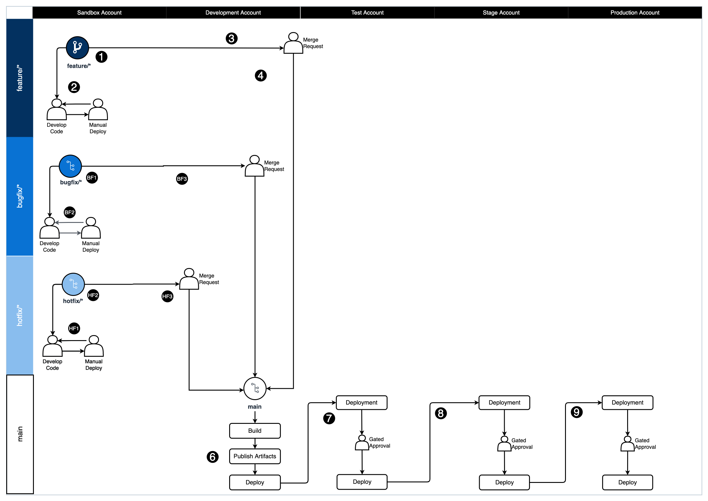

# Git Branching Strategy for GitHub Flow

## Summary
Clients that are implementing DevOps processes would benefit from a visual guide to assist them in understanding how a Git branching strategy can inform deployments to different environments with their DevOps processes. Using a standard workflow for managing the source code repository like GitHub Flow will assist development teams in aligning their work as a team.

This guide provides a visual diagram to illustrate how a DevOps process following GitHub Flow could be implemented by an organization. This guide also includes recommended tasks to perform at each step in the DevOps process.

The linked Git repository contains a diagram outlining the recommendations and can be used like a [punnett square](https://en.wikipedia.org/wiki/Punnett_square) to line up the branches on the horizontal axis with the AWS environments on the vertical axis to determine what actions to perform in each scenario.

The numbers in circles are to be used as a guide to help understand the order in which to follow the diagram with an example feature all the way to production deployment. 

## Prerequisites
- Install [Git](https://git-scm.com/downloads) for source code repository tool
- Install [Draw.io](https://github.com/jgraph/drawio-desktop/releases) Desktop to view/edit the diagram 

## Architecture
### Target technology stack
This pattern can be applied to any technology stack but targets using the “GitHub Flow” branching strategy popularized for the Git distributed version control system.

### Automation and scale
This is a visual guide to implement automation of the DevOps processes for each step in the GitHub Flow workflow.

## Tools
- [Draw.io Desktop](https://github.com/jgraph/drawio-desktop/releases)

## Code
- Draw.io diagram to review [here](https://gitlab.aws.dev/proserve-tdx/incubator/git-branching-strategy-for-github/-/blob/main/GitHub_Flow.drawio)
- Diagram can be used to modify for your organizations preferences

## APG
Please reference the internal [APG artifact](https://apg-library.amazonaws.com/content/780a5bce-3cd2-4092-8537-b7a77c3d6b8d) for further information.

## Diagram

## Best Practices
DevOps practices vary across organizations and this guide is intended to be used as a quick start and discussion starter for the organization or development teams within it.

This artifact isn’t intended to weigh the pros or cons of one workflow versus another but rather document how the GitHub Flow approach can work with an organization's DevOps processes.

To successfully adopt GitHub Flow-based development, it's important to follow a set of best practices that promote collaboration, maintain code quality, and support continuous integration and delivery. Here are some key best practices for GitHub Flow-based development:

1. Keep changes small and frequent: Encourage developers to commit small, incremental changes in feature branches multiple times a day. This reduces the risk of merge conflicts and makes it easier to identify and fix issues quickly.

2. Use feature toggles: To manage the release of incomplete or experimental features, use feature toggles or feature flags. This allows you to hide, enable, or disable specific features in production without affecting the main branch's stability.

3. Maintain a robust test suite: A comprehensive, well-maintained test suite is crucial for detecting issues early and ensuring the codebase remains stable. Make sure to invest in test automation and prioritize fixing any failing tests.

4. Embrace continuous integration: Use continuous integration tools and practices to automatically build, test, and integrate code changes into the main branch. This helps catch issues early and streamlines the development process.

5. Perform code reviews: Encourage peer code reviews to maintain code quality, share knowledge, and catch potential issues before they're integrated into the main branch. Use pull requests or other code review tools to facilitate this process.

6. Monitor and fix broken builds: When a build breaks or tests fail, prioritize fixing the issue as soon as possible. This ensures the main branch remains in a releasable state and minimizes the impact on other developers.

7. Communicate and collaborate: Promote open communication and collaboration among team members, as GitHub Flow-based development relies on a high level of teamwork and coordination. Ensure developers are aware of ongoing work and changes being made to the codebase.

8. Refactor continuously: Regularly refactor the codebase to improve its maintainability and reduce technical debt. Encourage developers to leave the code in a better state than they found it.

9. Use short-lived branches for complex tasks: For larger or more complex tasks, you can still use short-lived branches (also known as "task branches") to work on the changes. However, make sure to keep the branch lifespan short (typically less than a day) and merge the changes back into the main branch as soon as possible.

10. Train and support the team: Provide training and support to developers who are new to GitHub Flow-based development or may require guidance in adopting its best practices.

By following these best practices, you can effectively implement GitHub Flow-based development, fostering collaboration, improving code quality, and streamlining the development process.

## What is GitHub Flow?
GitHub Flow is a lightweight, branch-based workflow that is designed to be simple and easy to use. It was developed by GitHub, the popular web-based hosting service for software development projects. GitHub Flow is based on the idea of short-lived feature branches that are merged into the main branch (usually called "master" or "main") when the feature is complete and ready to be deployed.

The key principles of GitHub Flow are:

1. Branching is lightweight and easy: Developers can create feature branches for their work with just a few clicks, making it easy to collaborate and experiment without disrupting the main branch.
2. Continuous deployment: Changes are deployed as soon as they are merged into the main branch, allowing for rapid feedback and iteration.
3. Merge requests: Developers use merge requests to initiate a discussion and review process before merging their changes into the main branch.

- [GitHub Flow Quickstart](https://docs.github.com/en/get-started/quickstart/github-flow)
- [Why GitHub Flow?](https://githubflow.github.io/)

## Advantages
GitHub Flow offers several advantages that can improve the development process, streamline collaboration, and enhance the overall quality of the software. Here are some of the key benefits:

1. Flexible and Lightweight: GitHub Flow is a lightweight and flexible workflow that makes it easy to collaborate on software development projects. It allows for quick iteration and experimentation without unnecessary complexity.

1. Simplified Collaboration: GitHub Flow simplifies collaboration by providing a clear and streamlined process for managing feature development. It encourages small, focused changes that can be easily reviewed and merged, making it easier for teams to work together efficiently.

1. Clear Version Control: With GitHub Flow, every change is made in a separate branch, ensuring a clear and traceable version control history. This enables developers to easily track and understand changes, revert if necessary, and maintain a reliable codebase.

1. Seamless Continuous Integration: GitHub Flow seamlessly integrates with continuous integration (CI) tools, allowing automated testing and deployment processes to be triggered upon pull request creation. This ensures that changes are thoroughly tested before they are merged into the main branch, reducing the risk of introducing bugs into the codebase.

1. Rapid Feedback and Continuous Improvement: GitHub Flow encourages a rapid feedback loop by promoting frequent code reviews and discussions through pull requests. This facilitates early detection of issues, promotes knowledge sharing among team members, and ultimately leads to higher code quality and better collaboration within the development team.

1. Simplified Rollbacks and Reverts: In the event that a code change introduces an unexpected bug or issue, GitHub Flow simplifies the process of rolling back or reverting the change. By having a clear history of commits and branches, it is easier to identify and revert problematic changes, helping to maintain a stable and functional codebase.

1. Lightweight Learning Curve: GitHub Flow is relatively easy to learn and adopt, especially for teams already familiar with Git and version control concepts. Its simplicity and intuitive branching model make it accessible for developers of varying experience levels, reducing the learning curve associated with adopting new development workflows.

1. GitHub Flow empowers teams to embrace a continuous deployment approach by enabling the immediate deployment of every change as soon as it is merged into the main branch. This streamlined process eliminates unnecessary delays and ensures that the latest updates and improvements are quickly made available to users, leading to a more agile and responsive development cycle. By embracing continuous deployment through GitHub Flow, teams can maximize the value delivered to users and swiftly iterate on their software, creating a dynamic and efficient development environment.

While GitHub Flow-based development has its advantages, it's important to remember that it may not be suitable for all teams or projects. The choice between GitHub Flow-based strategy and other strategies depends on various factors, such as team size, project requirements, and the desired balance between collaboration, integration frequency, and release management.

## Disadvantages
While GitHub Flow offers several advantages, it is important to consider its potential disadvantages as well:

1. Limited Suitability for Large Projects: GitHub Flow may not be as suitable for large-scale projects with complex codebases and multiple long-term feature branches. In such cases, a more structured workflow, like Gitflow, may provide better control over concurrent development and release management.

1. Lack of Formal Release Structure: GitHub Flow does not explicitly define a release process or support features like versioning, hotfixes, or maintenance branches. This can be a limitation for projects that require strict release management or have a need for long-term support and maintenance.

1. Limited Support for Long-Term Release Planning: GitHub Flow focuses on short-lived feature branches, which may not align well with projects that require long-term release planning, such as those with strict roadmaps or extensive feature dependencies. Managing complex release schedules can be challenging within the constraints of GitHub Flow.

1. Potential for frequent Merge Conflicts: Since GitHub Flow encourages frequent branching and merging, there is a possibility of encountering merge conflicts, especially in projects with high development activity. Resolving these conflicts can be time-consuming and may require additional effort from the development team.

1. Lack of Formalized Workflow Phases: GitHub Flow does not define explicit phases for development, such as alpha, beta, or release candidate stages. This can make it harder to communicate the project's current state or the stability level of different branches or releases.

1. Impact of Breaking Changes: Since GitHub Flow encourages merging changes into the main branch frequently, there is a higher risk of introducing breaking changes that affect the stability of the codebase. Strict code review and testing practices become crucial to mitigate this risk effectively.

Teams should carefully consider these drawbacks when deciding whether GitHub Flow-based development is the right approach for their project.

## Accounts / Environments
Most organizations have several environments or accounts outlined for use: 

### Sandbox 
Environment where developers write code, make mistakes, perform proof of concept work.
### Development
Environment where developers integrate their code together to ensure it all works as one cohesive application.
### Test
Environment where QA teams or acceptance testing takes place. Often teams will do performance or integration testing in this environment.
### Stage
Pre-production environment. This environment is configured the same as the Production environment to ensure that code and infrastructure will operate normally in Production. 
### Production
This is the environment that is running in production and handling real client traffic.

## GitHub Flow Branches
### main
The main branch always represents the code that is running in production.

Code is merged into the main branch from feature branches through Merge Requests.

Main branch should have branch protection enabled to prevent deletion and to restrict developers pushing code directly to main.

##### Naming Convention
`main`

### feature
Feature branches are where the development of features is completed. 
The feature branch is created by branching off of the develop branch using the name pattern of `feature/<ticket number>_<Developer initials>_<Descriptor>`
Developers will iterate on the code and commit and test code in the feature branch. 
Once the feature is complete the developer will promote the feature forward by creating a Merge Request to `main`

##### Naming Convention
`feature/<ticket number>_<Developer initials>_<Descriptor>`
##### Example
`feature/123456_MS_Implement_Feature_A`

### bugfix
The bugfix branch is used to fix issues

bugfix branches are branched off of the `main` branch.

After the bugfix is tested in `sandbox` or any of the lower environments, it can be promoted to higher environments by merging it to `main` through a Merge Request.

##### Naming Convention
`bugfix/<ticket number>_<Developer initials>_<Descriptor>`
##### Example
`bugfix/123456_MS_Fix_Problem_A`

## GitHub Flow Processes
### Standard GitHub Flow Process
1. Create a `feature` branch: At the beginning of a new feature, a developer creates a new feature branch off the main branch. This branch follows the naming pattern `feature/{ticket}_{initials}_{short description}`.
2. Add commits: The developer adds one or more commits to the `feature` branch, each representing a discrete change or improvement.
3. Open a merge request: Upon completion of the feature, the developer opens a merge request (PR) to merge the changes into the `main` branch. This triggers a review process, where other developers can review the code and provide feedback.
4. Discuss and review: During the review process, developers can discuss the code changes and provide feedback. The goal is to ensure that the changes are of high quality and meet the project's standards.
5. Upon the creation of a Merge Request, an automated build process is triggered, followed by deployment to the development environment. Here, automated tests are executed to verify the integrity and quality of the changes encapsulated in the Merge Request. A successful build, deployment and testing are required for merging the merge request.
6. Merge the changes to `main`: Once the review process is complete, the changes are merged into the `main` branch. 
7. Manual approval for deployment of the release artifacts to the Test environment
8. Manual approval for deployment of the release artifacts to the Stage environment
9. Manual approval for deployment of the release artifacts to the Production environment

### Bugfix GitHub Flow Process
1. Create a new `bugfix` branch: When a bug is discovered, a developer creates a new branch from the main branch to fix the issue.
1. Fix the bug: The developer fixes the bug on the new branch and tests the fix thoroughly.
1. Open a merge request: Once the fix is complete, the developer opens a merge request to merge the changes into the main branch. This triggers a review process, where other developers can review the code and provide feedback.
1. Deploy the fix: The changes are merged into the main branch and deployed as part of the next deployment from `main` to the higher environments.

### Hotfix GitHub Flow Process
GitHub Flow is designed to enable continuous delivery, where code changes are frequently and reliably deployed to higher environments. The key is that every feature branch is deployable at any time.

Hotfixes, akin to features or bugfixes, can follow the same process: creating a new branch, committing changes, opening a merge request, reviewing the code, merging to main upon approval, and then deploying. However, given their urgency, hotfixes typically have a higher priority. Depending on the team's policies and the immediacy of the situation, certain steps in the process could be expedited. For instance, code reviews for hotfixes might be fast-tracked. Therefore, while the hotfix process parallels the feature or bugfix process, the urgency surrounding hotfixes may warrant modifications in the procedural adherence. It's crucial to establish guidelines on managing hotfixes to ensure they are handled efficiently and securely.

## DevOps Accounts / Environments
### Sandbox
Location for development to take place and can be deployed to from local machine or through script on a local machine. 

##### Access
- Full developer access

##### Build Steps
1. Git Secrets Scanning
1. Lint Source Code
1. Build / Compile source code if applicable
1. Unit Test
1. Code Coverage
1. Static Code Analysis
1. Build IaC 
1. IaC Security Analysis
1. Extract Open Source Licenses
1. Publish Build Artifacts

##### Deployment Steps
1. Trigger: Manually triggered from developer's local machine
1. Perform database versioning
1. Perform IaC deployment
1. Perform Integration Tests

##### Expectations before PR to Develop
- Successful feature branch build
- Developer has manually deployed & tested in the sandbox environment

### Develop
Development environment containing the latest features included by merge request and are ready for deployment to higher environments. 

##### Access
- Permissions assigned by least privilege
- Less access than Sandbox environment

##### Build Steps
1. Git Secrets Scanning
1. Lint Source Code
1. Build / Compile source code if applicable
1. Unit Test
1. Code Coverage
1. Static Code Analysis
1. Build IaC 
1. IaC Security Analysis
1. Extract Open Source Licenses

##### Deployment Steps
1. Trigger: Automatically deploy when a Merge Request is created against `main`
1. Perform database versioning
1. Perform IaC deployment
1. Perform Integration Tests

##### Expectations before Test
- Successful develop branch build
- Successful develop branch deployment
- Unit Tests pass 100%
- Successful IaC build
- Deployment artifacts were successfully created
- Developer has performed manual verification to ensure that the feature is functioning as expected

### Test 
Test environments is used for QA validation of features by QA personnel. QA personnel will approve the changes after they finish testing for it to go to the next higher environment (Stage).

##### Access
- Permissions assigned by least privilege
- Less access than Develop environment

##### Build Steps
1. Git secrets scanning
1. Lint source code
1. Build / compile source code if applicable
1. Unit test
1. Code coverage
1. Static code analysis
1. Build IaC 
1. IaC security analysis
1. Extract open source licenses

##### Deployment Steps
1. Automatically trigger deployment when changes are merged to `main` branch.
1. Pause for manual approval by QA personnel
1. Download published artifacts
1. Perform database versioning
1. Perform IaC deployment
1. Perform integration tests
1. Perform performance tests

##### Expectations before moving to Stage
Gated deployed to this environment

### Stage
Data setup should be similar in scope / size to production workloads.

Preferred preview environment for business uses or previews.

##### Access
- Permissions assigned by least privilege
- Same access as the Production environment

##### Build Steps
1. None - Same artifacts built upon merge to `main`

##### Deployment Steps
1. Automatically queue up `Stage` deployment upon completion of the `Test` deployment
1. Pause for manual approval by business users
1. Download published artifacts
1. Perform database versioning
1. Perform IaC deployment

##### Expectations before moving to Production
- Stage deployment has been completed
- User Acceptance Test has been carried out by business users against Stage environment
- Optional - Integration testing successful
- Optional - Load testing successful

### Production
The Production environment supporting the released product, handling real data by real clients. This is a protected environment that is assigned access by least privilege and elevated access should only be allowed through an audited exception process for a limited period of time.

##### Access
- Read only limited AWS Console access
- Limited / read only developer access other than logging for day to day operations
- Gated release before deployment

##### Deployment Steps
1. Automatically queue up deployment upon successful deployment to `Stage`
1. Pause for manual approval by business users
1. Download published artifacts
1. Perform database versioning
1. Perform IaC deployment

## Things to watch out for
GitHub Flow encourages daily deployments to higher environments, embracing true CI/CD. It is imperative that the team has the engineering maturity to build features and create automation tests for them, and do an exhaustive Merge Request review before changes are approved. This fosters a robust engineering culture that promotes quality, accountability, and efficiency in the development process.

## Related Resources
There are many good resources for Git training on the web and this guide is not intended to teach comprehensive Git training. 

- [GitHub Flow Quickstart](https://docs.github.com/en/get-started/quickstart/github-flow)
- [Why GitHub Flow?](https://githubflow.github.io/)
- [12 Factor App - Build once, deploy many strategy](https://12factor.net/)

## Additional Git Branching Strategies
### Trunk
Trunk-based development is a software development practice in which all developers work on a single branch, typically called the 'trunk' or 'main' branch. The main idea behind this approach is to keep the codebase in a continuously releasable state by integrating code changes frequently and relying on automated testing and continuous integration.

Additional information for [Trunk Git Branching Strategies](/trunk/README.md) is available.

### GitFlow
GitFlow is a branching model that involves the use of feature branches and multiple other named primary branches to move code between development and production. GitFlow works well for teams that have scheduled release cycles and a need to define a collection of features as a release. Development is completed in individual feature branches that are merged with approval into an integration branch where they should be considered ready for production. Once enough features have accumulated in the integration branch, a release is created for deployments to upper level environments. This separation allows for better control over what changes are moving to which named environment on a schedule. This process can be accelerated into a faster deployment model if necessary.

Additional information for [GitFlow Git Branching Strategies](/gitflow/README.md) is available.

## Additional information
If you are unsure where to start your team’s journey to using Git and DevOps processes the authors recommend picking a standard solution and try what works. Start with a simple workflow and add complexity as needed.

Utilizing a standard branching convention allows the team to build upon existing documentation and learn what works best for them.

Don’t be afraid to change it up if it doesn’t work, work with the team as their needs/requirements adapt over time, there is no perfect solution.

## Authors and Acknowledgment
- Abhilash Vinod @vinodabh
- Mike Stephens @mstphns
