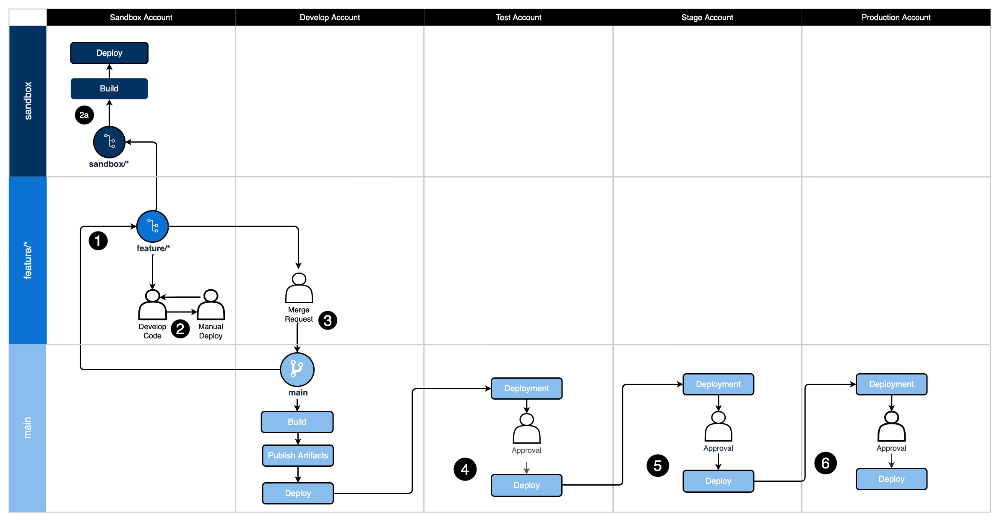

# Git Branching Strategy for Trunk

## Summary
Clients that are implementing DevOps processes would benefit from a visual guide to assist them in understanding how a Git branching strategy can inform deployments to different environments with their DevOps processes. Using a standard workflow for managing the source code repository like Trunk will assist development teams in aligning their work as a team.

This guide provides a visual diagram to illustrate how a DevOps process following Trunk could be implemented by an organization. This guide also includes recommended tasks to perform at each step in the DevOps process.

The linked [Git repository](https://gitlab.aws.dev/proserve-tdx/incubator/git-branching-strategy-for-trunk/) contains a [diagram](https://gitlab.aws.dev/proserve-tdx/incubator/git-branching-strategy-for-trunk/-/blob/main/TrunkBranchingWithDevopsOverview.drawio) outlining the recommendations and can be used like a [punnett square](https://en.wikipedia.org/wiki/Punnett_square) to line up the branches on the horizontal axis with the AWS environments on the vertical axis to determine what actions to perform in each scenario.

The numbers in circles are to be used as a guide to help understand the order in which to follow the diagram with an example feature all the way to production deployment. 

## Prerequisites
- Install [Git](https://git-scm.com/downloads) for source code repository tool
- Install [Draw.io](https://github.com/jgraph/drawio-desktop/releases) Desktop to view/edit the diagram 

## Architecture
### Target technology stack
This pattern can be applied to any technology stack but targets using the "Trunk" branching strategy popularized for the Git distributed version control system.

### Automation and scale
This is a visual guide to implement automation of the DevOps processes for each step in the GitFlow workflow.

## Tools
- [Draw.io Desktop](https://github.com/jgraph/drawio-desktop/releases)

## Code
- Draw.io diagram to review [here](https://gitlab.aws.dev/proserve-tdx/incubator/git-branching-strategy-for-trunk/-/blob/main/TrunkBranchingWithDevopsOverview.drawio)
- Diagram can be used to modify for your organizations preferences

## APG
Please reference the internal [APG artifact](https://apg-library.amazonaws.com/content/5df23e4d-84fe-4ab3-a54f-96b6406abc57) for further information.

## Diagram

## Best Practices
DevOps practices vary across organizations and this guide is intended to be used as a quick start and discussion starter for the organization or development teams within it.

This artifact isn’t intended to weigh the pros or cons of one workflow versus another but rather document how the Trunk approach can work with an organization's DevOps processes.

To successfully adopt trunk-based development, it's important to follow a set of best practices that promote collaboration, maintain code quality, and support continuous integration and delivery. Here are some key best practices for trunk-based development:

1. Keep changes small and frequent: Encourage developers to commit small, incremental changes to the main branch multiple times a day. This reduces the risk of merge conflicts and makes it easier to identify and fix issues quickly.

2. Use feature toggles: To manage the release of incomplete or experimental features, use feature toggles or feature flags. This allows you to hide, enable, or disable specific features in production without affecting the main branch's stability.

3. Maintain a robust test suite: A comprehensive, well-maintained test suite is crucial for detecting issues early and ensuring the codebase remains stable. Make sure to invest in test automation and prioritize fixing any failing tests.

4. Embrace continuous integration: Use continuous integration tools and practices to automatically build, test, and integrate code changes into the main branch. This helps catch issues early and streamlines the development process.

5. Perform code reviews: Encourage peer code reviews to maintain code quality, share knowledge, and catch potential issues before they're integrated into the main branch. Use pull requests or other code review tools to facilitate this process.

6. Monitor and fix broken builds: When a build breaks or tests fail, prioritize fixing the issue as soon as possible. This ensures the main branch remains in a releasable state and minimizes the impact on other developers.

7. Communicate and collaborate: Promote open communication and collaboration among team members, as trunk-based development relies on a high level of teamwork and coordination. Ensure developers are aware of ongoing work and changes being made to the codebase.

8. Refactor continuously: Regularly refactor the codebase to improve its maintainability and reduce technical debt. Encourage developers to leave the code in a better state than they found it.

9. Use short-lived branches for complex tasks: For larger or more complex tasks, you can still use short-lived branches (also known as "task branches") to work on the changes. However, make sure to keep the branch lifespan short (typically less than a day) and merge the changes back into the main branch as soon as possible.

10. Train and support the team: Provide training and support to developers who are new to trunk-based development or may require guidance in adopting its best practices.

By following these best practices, you can effectively implement trunk-based development, fostering collaboration, improving code quality, and streamlining the development process.

## What is Trunk?
Trunk-based development is a software development practice in which all developers work on a single branch, typically called the 'trunk' or 'main' branch. The main idea behind this approach is to keep the codebase in a continuously releasable state by integrating code changes frequently and relying on automated testing and continuous integration.

In trunk-based development, developers commit their changes to the main branch multiple times a day, aiming for small, incremental updates. This enables quick feedback loops, reduces the risk of merge conflicts, and fosters collaboration among team members. The practice emphasizes the importance of a well-maintained test suite, as it relies on automated testing to catch potential issues early and ensure the codebase remains stable and releasable.

Trunk-based development is often contrasted with feature-based development (also known as feature branching or feature-driven development), where each new feature or bug fix is developed in its own dedicated branch, separate from the main branch. The choice between trunk-based development and feature-based development depends on factors such as team size, project requirements, and the desired balance between collaboration, integration frequency, and release management.

## Advantages
Trunk-based development offers several advantages that can improve the development process, streamline collaboration, and enhance the overall quality of the software. Here are some of the key benefits:

1. Faster feedback loops: With trunk-based development, developers integrate their code changes frequently, often multiple times a day. This enables faster feedback on potential issues, allowing developers to identify and fix problems more quickly than they would in a feature-based development model.

2. Reduced merge conflicts: In trunk-based development, the risk of large, complicated merge conflicts is minimized because changes are integrated continuously. This helps maintain a cleaner codebase and reduces the time spent resolving conflicts, which can be both time-consuming and error-prone in feature-based development.

3. Improved collaboration: Trunk-based development encourages developers to work together on the same branch, promoting better communication and collaboration within the team. This can lead to faster problem-solving and a more cohesive team dynamic.

4. Easier code reviews: Since code changes are smaller and more frequent in trunk-based development, it can be easier to conduct thorough code reviews. Smaller changes are generally easier to understand and review, leading to more effective identification of potential issues and improvements.

5. Continuous integration and delivery: Trunk-based development supports the principles of continuous integration and continuous delivery (CI/CD). By keeping the codebase in a releasable state and integrating changes frequently, teams can more easily adopt CI/CD practices, leading to faster deployment cycles and improved software quality.

6. Enhanced code quality: With frequent integration, testing, and code reviews, trunk-based development can contribute to better overall code quality. Developers can catch and fix issues more quickly, reducing the likelihood of technical debt accumulating over time.

7. Simplified branching strategy: Trunk-based development simplifies the branching strategy by reducing the number of long-lived branches. This can make it easier to manage and maintain the codebase, especially for large projects or teams.

While trunk-based development has its advantages, it's important to remember that it may not be suitable for all teams or projects. The choice between trunk-based development and feature-based development depends on various factors, such as team size, project requirements, and the desired balance between collaboration, integration frequency, and release management.

## Disadvantages
Trunk-based development does have some disadvantages, which can impact the development process and the team dynamics. Here are a few notable drawbacks:

1. Limited isolation: Since all developers work on the same branch, their changes are immediately visible to everyone on the team. This can lead to developers stepping on each other's toes, causing unintended side effects or breaking the build. In contrast, feature-based development allows for better isolation of changes, enabling developers to work more independently.

2. Increased pressure on testing: Trunk-based development relies on continuous integration and automated testing to catch issues quickly. However, this approach can put a lot of pressure on the testing infrastructure and requires a well-maintained test suite. If the tests aren't comprehensive or reliable, it can lead to undetected issues in the main branch.

3. Less control over releases: Trunk-based development aims to keep the codebase in a continuously releasable state. While this can be advantageous, it may not always be suitable for projects with strict release schedules or those that require specific features to be released together. Feature-based development provides more control over when and how features are released.

4. Code churn: With developers constantly integrating changes into the main branch, trunk-based development can lead to increased code churn. This can make it difficult for developers to keep track of the current state of the codebase and may cause confusion when trying to understand the impact of recent changes.

5. Requires a strong team culture: Trunk-based development demands a high level of discipline, communication, and collaboration among team members. This can be challenging to maintain, particularly in larger teams or when working with developers who are less experienced with this approach.

6. Scalability challenges: As the size of the development team grows, the number of code changes being integrated into the main branch can increase rapidly. This can lead to more frequent build breaks and test failures, making it difficult to keep the codebase in a releasable state.

Teams should carefully consider these drawbacks when deciding whether trunk-based development is the right approach for their project.

## Accounts / Environments
Most organizations have several environments or accounts outlined for use: 

### Sandbox 
Environment where developers write code, make mistakes, perform proof of concept work.
### Development
Environment where developers integrate their code together to ensure it all works as one cohesive application.
### Test
Environment where QA teams or acceptance testing takes place. Often teams will do performance or integration testing in this environment.
### Stage
Pre-production environment. This environment is configured the same as the Production environment to ensure that code and infrastruction will operate normally in Production. 
### Production
This is the environment that is running in production and handling real client traffic.

## Trunk Branches
### main
The main branch always represents the code that is running in production.

Code is branched from main, developed, then merged back to main. 
Deployments from main could target any environment.

Main branch should have branch protection enabled to prevent deletion.

##### Naming Convention
`main`

### feature
Feature branches are where the development of features is completed. 
The feature branch is created by branching off of the develop branch using the name pattern of `feature/<story number>_<Developer initials>_<Descriptor>`
Developers will iterate on the code and commit and test code in the feature branch. 
Once the feature is complete the developer will promote the feature forward.
There are only two paths forward from a feature branch.
- Merge into the sandbox branch
- Create a merge request into the main branch.

##### Naming Convention
`feature/<story number>_<Developer initials>_<Descriptor>`
##### Example
`feature/123456_MS_Implement_Feature_A`

### hotfix
Hotfixes are just feature branches, use a feature branch.

### sandbox
This branch is a non-standard Trunk branch but it useful for pipeline development.
The sandbox branch is primarily used for two purposes outlined below.
- Perform a full deployment to the Sandbox environment using the build & deployment pipelines. 
- Perform pipeline development prior to submitting merge requests for full testing in a lower environment. 

Sandbox branches are temporary in nature and are not meant to be a long lived branch and should be cleaned up after the specific testing is complete.

##### Naming Convention
`sandbox/<story number>_<Developer initials>_<Descriptor>`
##### Example
`sandbox/123456_MS_Test_Pipeline_Deploy`

## Trunk Processes
### Standard Trunk Process
1. Developer will create a `feature` branch from `main` branch with naming pattern `feature/{ticket}_{initials}_{short description}`
1. Developer will develop code and deploy to `Sandbox` environment iteratively to complete ticket. 
    - Developer can optionally create a `sandbox` branch to execute the automated build/deploy pipeline in the `Sandbox` environment.
1. Developer will create a merge request from feature branch back into `main` using a squash merge.
1. CICD system will automatically build and publish artifacts from the `main` branch.
1. Manual approval for deployment of the `main` artifacts to the `Develop` environment
1. Manual approval for deployment of the `main` artifacts to the `Test` environment
1. Manual approval for deployment of the `main` artifacts to the `Stage` environment
1. Manual approval for deployment of the `main` artifacts to the `Production` environment

## DevOps Accounts / Environments
### Sandbox
Location for development to take place and can be deployed to from local machine or through script on a local machine. 

##### Access:
- Full developer access

##### Build Steps
1. Git Secrets Scanning
1. Lint Source Code
1. Build / Compile source code if applicable
1. Unit Test
1. Code Coverage
1. Static Code Analysis
1. Build IaC 
1. IaC Security Analysis
1. Extract Open Source Licenses
1. Publish Build Artifacts

##### Deployment Steps
1. Trigger: Automatically deploy upon successful sandbox branch build
1. Download published artifacts
1. Perform database versioning
1. Perform IaC deployment
1. Perform Integration Tests

##### Expectations before PR to Main:
- Successful feature branch build
- Developer has manually deployed & tested in the sandbox environment

### Develop
Development environment containing the latest features included by merge request and are ready for release. 

##### Access
- Permissions assigned by least privilege
- Less access than Sandbox environment

##### Build Steps
1. Git Secrets Scanning
1. Lint Source Code
1. Build / Compile source code if applicable
1. Unit Test
1. Code Coverage
1. Static Code Analysis
1. Build IaC 
1. IaC Security Analysis
1. Extract Open Source Licenses

##### Deployment Steps
1. Trigger: Automatically deploy upon successful develop branch build
1. Download published artifacts
1. Perform database versioning
1. Perform IaC deployment
1. Perform Integration Tests

##### Expectations before Test:
- Successful develop branch build
- Successful develop branch deployment
- Unit Tests pass 100%
- Successful IaC build
- Deployment artifacts were successfully created
- Developer has performed manual verification to ensure that the feature is functioning as expected

### Test 
Environment to be targeted by “release” branchs for QA operations. It can also be used for QA validation of features against a test environment by QA personnel.

##### Access
- Permissions assigned by least privilege
- Less access than Develop environment

##### Build Steps - Initial Creation of `release` branch
1. Git secrets scanning
1. Lint source code
1. Build / compile source code if applicable
1. Unit test
1. Code coverage
1. Static code analysis
1. Build IaC 
1. IaC security analysis
1. Extract open source licenses

##### Deployment Steps
1. Automatically create deployment upon successful release branch build
1. Pause for manual deployment by approved personel
1. Download published artifacts
1. Perform database versioning
1. Perform IaC deployment
1. Perform integration tests
1. Perform performance tests

##### Expectations before moving to Stage:
Gated deployed to this environment

### Stage
Data setup should be similar in scope / size to production workloads.

Preferred preview environment for business uses or previews.

##### Access
- Permissions assigned by least privilege
- Same access as the Production environment

##### Build Steps
1. None - Same artifacts built upon creation of release branch are reused

##### Deployment Steps
1. Automatically create deployment upon successful release branch build
1. Pause for manual deployment by approved personel
1. Download published artifacts
1. Perform database versioning
1. Perform IaC deployment

##### Expectations before moving to Production:
- “Release” has been deployed successfully to a Stage environment
- Optional - Integration testing successful
- Optional - Load testing successful

### Production
The Production environment supporting the released product, handling real data by real clients. This is a protected environment that is assigned access by least privilege and elevated access should only be allowed through an audited exception process for a limited period of time.

##### Access: 
- Read only limited AWS Console access
- Limited / read only developer access other than logging for day to day operations
- Gated release before deployment

##### Deployment Steps
1. Automatically create deployment upon successful release branch build
1. Pause for manual deployment by approved personel
1. Download published artifacts
1. Perform database versioning
1. Perform IaC deployment

## Related Resources
There are many good resources for Git training on the web and this guide is not intended to teach comprehensive Git training. 
- [12 Factor App - Build once, deploy many strategy](https://12factor.net/)

# Additional Git Branching Strategies
### GitFlow
GitFlow is a branching model that involves the use of feature branches and multiple other named primary branches to move code between development and production. GitFlow works well for teams that have scheduled release cycles and a need to define a collection of features as a release. Development is completed in individual feature branches that are merged with approval into an integration branch where they should be considered ready for production. Once enough features have accumulated in the integration branch, a release is created for deployments to upper level environments. This separation allows for better control over what changes are moving to which named environment on a schedule. This process can be accelerated into a faster deployment model if necessary.

Additional information for [GitFlow Git Branching Strategies](/gitflow/README.md) is available.

### GitHub Flow
GitHub Flow is a lightweight, branch-based workflow that is designed to be simple and easy to use. It was developed by GitHub, the popular web-based hosting service for software development projects. GitHub Flow is based on the idea of short-lived feature branches that are merged into the main branch (usually called "master" or "main") when the feature is complete and ready to be deployed.

Additional information for [GitHub Flow Git Branching Strategies](/github-flow/README.md) is available.

## Additional information
If you are unsure where to start your team’s journey to using Git and DevOps processes the authors recommend picking a standard solution and try what works.

Utilizing a standard branching convention allows the team to build upon existing documentation and learn what works best for them.

Don’t be afraid to change it up if it doesn’t work, work with the team as their needs/requirements adapt over time, there is no perfect solution.

## Authors and Acknowledgment
- Mike Stephens @mstphns
- Rayjan Wilson @rayjwil
